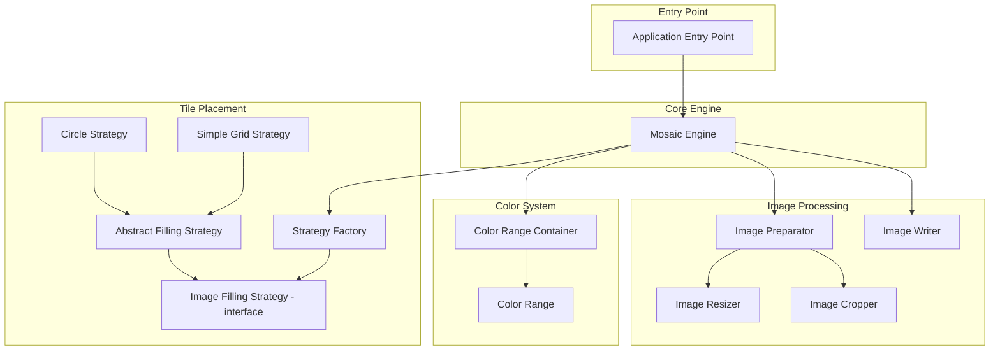
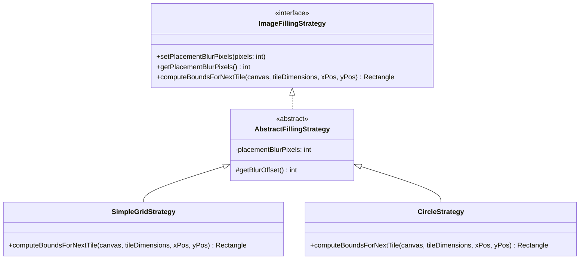
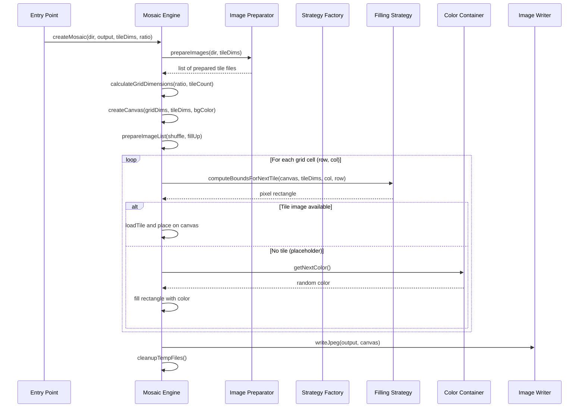

# Architecture & Component Design

## Component Overview

## Components

### Application Entry Point

Responsible for:
- Reading and parsing the configuration file
- Accepting command-line arguments (source directory, output filename, tile dimensions, aspect ratio, behavior overrides)
- Merging defaults from configuration with command-line overrides
- Instantiating the Mosaic Engine and invoking mosaic creation

### Mosaic Engine

The central orchestrator. Responsible for:
- Coordinating the entire pipeline from image preparation to output
- Managing the tile list (shuffling, fill-up)
- Calculating the actual grid dimensions
- Creating the output canvas
- Delegating tile placement to the filling strategy
- Handling color space conversions when tile color profiles don't match the canvas
- Triggering cleanup of temporary files

**Key method**: `createMosaic(sourceDirectory, outputFile, tileDimensions, aspectRatio)`

### Image Preparator

Scans the source directory for JPEG files and ensures each one conforms to the required tile dimensions:
1. Loads each image
2. If dimensions don't match: crops, then resizes
3. Saves processed images as temporary files
4. Returns a list of file references ready for placement

### Image Cropper (Center-Crop)

Crops an image to match the target aspect ratio by removing excess content from the edges. Always crops from the center so the subject of the image is preserved. See [algorithms.md](algorithms.md) for the detailed math.

### Image Resizer

Resizes an image to exact pixel dimensions using bicubic interpolation for high-quality downscaling/upscaling.

### Image Writer

Encodes an in-memory image to JPEG format and writes it to disk.

### Color Range

Represents a continuous range between two RGB colors. Given a lower bound and upper bound color, it can generate random colors where each channel (R, G, B) is independently randomized between the corresponding bounds.

### Color Range Container

Holds multiple `ColorRange` instances. When asked for a color, it randomly selects one of its ranges and generates a color from it. This allows defining multiple distinct color palettes that are used randomly.

### Image Filling Strategy (Strategy Pattern)

An interface that defines how tiles are positioned on the mosaic canvas.

- **Interface** defines `computeBoundsForNextTile()` which returns the pixel rectangle where the next tile should be drawn.
- **Abstract base** provides placement blur logic: a random offset between 0 and `placementBlurPixels`.
- **Simple Grid Strategy** (`NORMAL`): places tiles in a straightforward row-by-column grid with optional blur offset.
- **Circle Strategy** (`CIRCLE`): intended for circular tile arrangements (not fully implemented in legacy version).

### Strategy Factory

Resolves a strategy name (from configuration) to a concrete implementation:
1. Reads the strategy name (e.g., `CIRCLE`)
2. Looks up `{name}_CLASS` in configuration to find the implementation class
3. Instantiates and returns it

This allows new placement strategies to be added simply by:
1. Implementing the filling strategy interface
2. Adding a `{NAME}_CLASS` mapping in the configuration

## Data Flow

