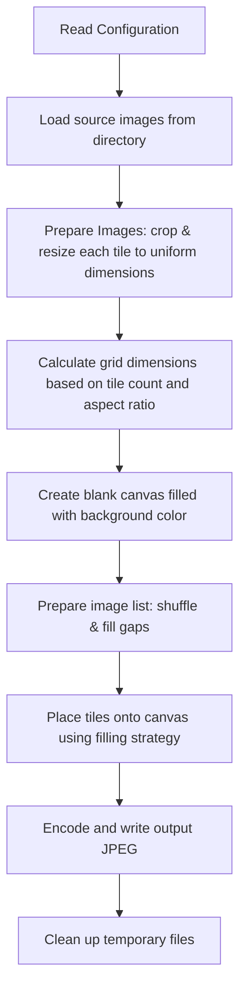

# Mosaicr - Application Overview

## What is Mosaicr?

Mosaicr is a **photo mosaic generator**. It takes a collection of small images (tiles) from a directory and assembles them into a single large mosaic image. The result is a grid of uniformly sized tiles arranged to form one composite image.

## Input / Output

| | Description |
|---|---|
| **Input** | A directory of JPEG images (the tiles) and a configuration file |
| **Output** | A single JPEG mosaic image composed of the input tiles arranged in a grid |

## High-Level Pipeline

The mosaic creation process follows these steps:

### Step-by-Step

1. **Read Configuration** — Load settings from a properties file: tile size, grid aspect ratio, colors, behavior flags, and filling strategy.

2. **Prepare Images** — Scan the source directory for `.jpg` files. For each image that doesn't match the required tile dimensions:
   - **Center-crop** to match the target aspect ratio (removing excess width or height from the edges).
   - **Resize** to the exact tile dimensions using high-quality bicubic interpolation.
   - Save the processed tile as a temporary file.

3. **Calculate Grid Dimensions** — Starting from the configured aspect ratio (e.g., 19×4), scale the grid up proportionally until it has enough cells to hold all available tiles.

4. **Create Canvas** — Allocate a blank image of size `(gridColumns × tileWidth)` × `(gridRows × tileHeight)`, filled with the configured background color.

5. **Prepare Image List** — Optionally shuffle the tiles. If there are fewer tiles than grid cells, either cycle through existing tiles to fill gaps, or insert empty placeholders (which will become solid-color rectangles).

6. **Fill the Mosaic** — Iterate through each grid cell and place the corresponding tile. The placement strategy is pluggable (e.g., simple grid or circular arrangement). Missing tiles are filled with a solid color, optionally randomized within configured color ranges. A "placement blur" option can add small random offsets to tile positions for a less rigid look.

7. **Write Output** — Encode the completed mosaic as a JPEG file.

8. **Cleanup** — Delete all temporary rescaled image files.
